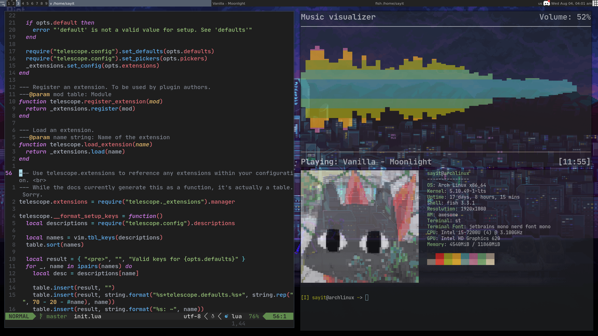

# Dotfiles

My configuration files for Neovim as well as other things. This also includes a script to install the packages I use.

## Requirements

* [Paru](https://github.com/Morganamilo/paru)
* JetBrains Mono Nerd Font Mono (for the extra Neovim bling :ok_hand:)
* [Lain](https://github.com/lcpz/lain) and st (for AwesomeWM)
